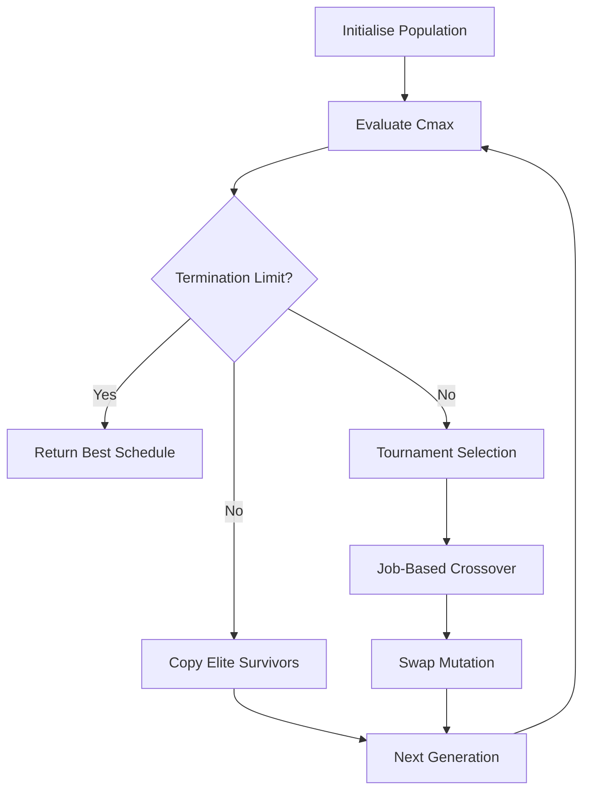
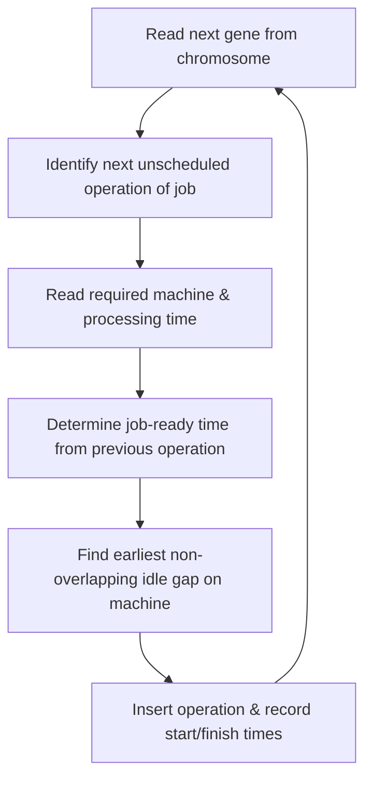
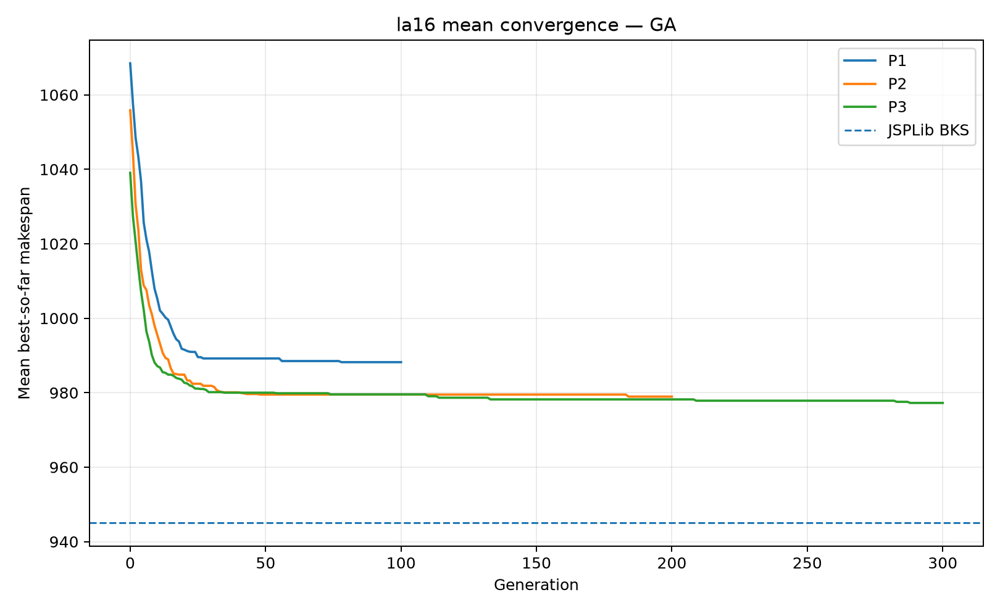
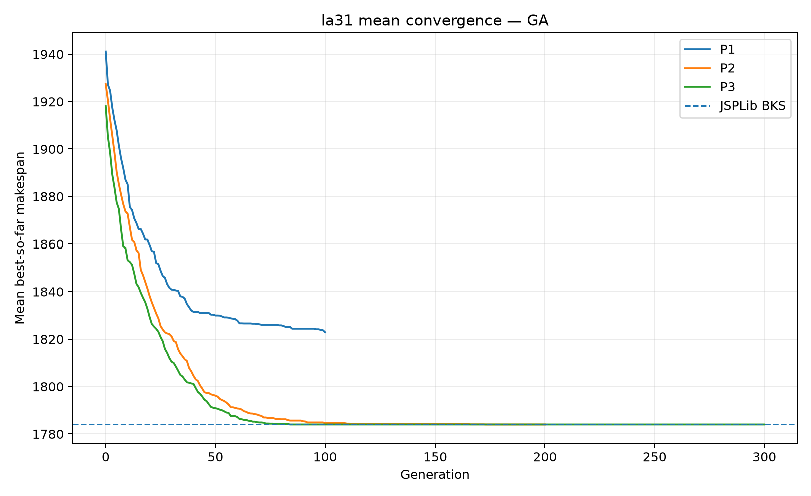
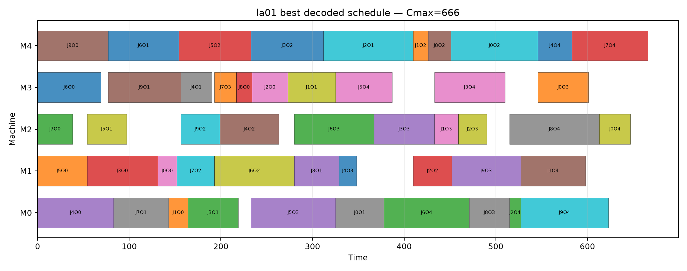
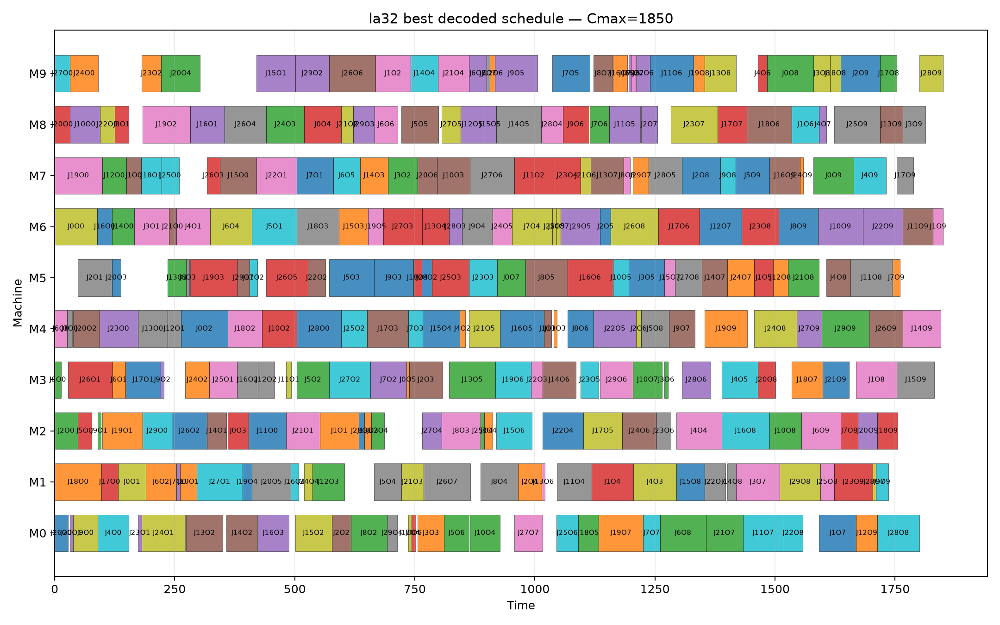

# Job Shop Scheduling with a Genetic Algorithm

**ACIT4610 – Mid-Term Group Portfolio/Project 1 (2026), Group 7**

This repository implements a Genetic Algorithm (GA) for the Job Shop Scheduling Problem (JSSP) using six Lawrence (1984) benchmark instances from JSPLib.

The implementation follows the GA flow used in the course:

> **Initialise → Evaluate → Select → Crossover → Mutation → Repeat**

For JSSP, evaluation first requires chromosome decoding:

> **operation-based genotype → Active Schedule Building Algorithm (SBA) with earliest-feasible-gap insertion → feasible schedule phenotype → makespan `Cmax`**

## Table of Contents

- [Project Documentation](#project-documentation)
- [Benchmark instances](#benchmark-instances)
- [GA design](#ga-design)
  - [1. Chromosome representation](#1-chromosome-representation)
  - [2. Initialisation](#2-initialisation)
  - [3. Schedule Building Algorithm (SBA)](#3-schedule-building-algorithm-sba)
  - [4. Objective / fitness evaluation](#4-objective--fitness-evaluation)
  - [5. Parent selection](#5-parent-selection)
  - [6. Crossover](#6-crossover)
  - [7. Mutation](#7-mutation)
  - [8. Elitism and best-so-far tracking](#8-elitism-and-best-so-far-tracking)
  - [9. Termination](#9-termination)
- [Parameter sets](#parameter-sets)
- [Installation](#installation)
- [Verification](#verification)
- [Main experiment](#main-experiment)
- [Summary of Results](#summary-of-results)
- [Generated outputs](#generated-outputs)
- [AI Use Disclosure](#ai-use-disclosure)

## Project Documentation

Detailed project documentation and report evidence can be found in the [`docs/`](docs/) directory:

- [`ASSIGNMENT_REQUIREMENTS_CHECKLIST.md`](docs/ASSIGNMENT_REQUIREMENTS_CHECKLIST.md)
- [`CODE_EXPLANATION.md`](docs/CODE_EXPLANATION.md)
- [`REFERENCES.md`](docs/REFERENCES.md)
- [`REPORT_EVIDENCE_MAP.md`](docs/REPORT_EVIDENCE_MAP.md)
- [`RESULTS_TABLES.md`](docs/RESULTS_TABLES.md)
- [`SOURCE_ALIGNMENT.md`](docs/SOURCE_ALIGNMENT.md)

## Benchmark instances

| Category | Instances | Size | JSPLib BKS |
|---|---|---:|---:|
| Small | `la01`, `la02` | 10 jobs × 5 machines | 666, 655 |
| Medium | `la16`, `la17` | 10 jobs × 10 machines | 945, 784 |
| Large | `la31`, `la32` | 30 jobs × 10 machines | 1784, 1850 |

Dataset source: JSPLib, Lawrence1984 family.

- https://scheduleopt.github.io/benchmarks/jsplib/
- https://github.com/ScheduleOpt/benchmarks/tree/main/jobshop/instances/text/Lawrence1984

## GA design

The Genetic Algorithm follows a continuous evolutionary loop:



### 1. Chromosome representation

A chromosome is an **operation-based repeated-job sequence**. Job `j` appears once for every operation belonging to that job.

Example for three jobs with three operations each:

```text
[0, 1, 2, 0, 2, 1, 0, 1, 2]
```
Job and operation indices are zero-based in the Python implementation.

The first occurrence of `0` represents the first operation of Job 0, the second occurrence represents its second operation, and so on. The chromosome is the **genotype**; it stores operation-order information rather than explicit start and finish times.

### 2. Initialisation

The program builds the required repeated-job multiset and shuffles it. This creates random valid chromosomes while preserving the correct number of operations for every job.

### 3. Schedule Building Algorithm (SBA)

`decode_chromosome()` uses an **Active Schedule Building Algorithm (SBA) with earliest-feasible-gap insertion**. The chromosome is read from left to right, and each operation is placed at the earliest valid idle time on its required machine.



#### Decoding

For each gene:

1. Identify the next unscheduled operation of the referenced job.
2. Read its required machine and processing time.
3. Determine its job-ready time from the completion time of its preceding operation.
4. Inspect the occupied intervals on the required machine.
5. Place the operation in the earliest feasible, non-overlapping idle slot that begins no earlier than its job-ready time.
6. Record the operation’s start and finish times.
7. Update the job-ready time and next-operation index.
8. Continue until all chromosome genes have been decoded.
9. Calculate $C_{\max}$ and return the completed schedule.


#### Resource Allocation

Each operation is assigned to the machine specified for that operation in the Lawrence benchmark instance.

The decoder also respects the required order of operations within each job. An operation cannot start before the preceding operation of the same job has finished.

The decoder therefore enforces the two main JSSP constraints:

- **Precedence:** operation `k+1` of a job cannot start before operation `k` finishes.
- **Machine capacity:** a machine can process at most one operation at a time.

#### Conflict Resolution

The implementation uses an **Active schedule-building technique with earliest-feasible-gap insertion**.

Instead of simply appending an operation to the end of a machine's schedule, the decoder searches the machine's occupied intervals and inserts the operation into the earliest feasible idle gap that satisfies both machine availability and job precedence.

`schedule_is_feasible()` independently re-checks schedule completeness, correct machine assignment and processing duration, job precedence, and machine non-overlap.

#### Makespan Calculation

After all operations are scheduled, `job_ready_time[j]` contains the completion time of the final operation of job `j`. This corresponds to the job completion time $C_i$.

The makespan is therefore:

$$
C_{\max} = \max_i C_i
$$

where $C_i$ is the completion time of the final operation of job $i$.

In the implementation, this is calculated using:

```python
makespan = max(job_ready_time)
```

The Genetic Algorithm minimises $C_{\max}$, so a smaller makespan represents a better schedule.


### 4. Objective / fitness evaluation

The objective is:

$$
\min C_{\max}
$$

$$
C_{\max} = \max_i C_i
$$

and $C_i$ is the completion time of the final operation of job $i$.

The implementation compares decoded makespans directly:

```text
smaller Cmax = better
```

Tournament selection therefore chooses the candidate with the lower makespan.

### 5. Parent selection

**Binary tournament selection (`k=2`)** is used. Two chromosomes are sampled at random, evaluated by makespan, and the one with the lower `Cmax` is selected as a parent.

### 6. Crossover

**Job-Based Crossover (JBX)** is used because the operation-sequence representation contains repeated job IDs. For each child, half of the job classes are selected to preserve their positions from the first parent. The remaining positions are filled using the relative order of the other job classes from the second parent. The two children use reversed parent roles, and each child selects its preserved job subset independently.

JBX preserves the required number of occurrences of each job, so no repair step is required.

### 7. Mutation

**Swap mutation** exchanges two positions containing different job IDs. The order changes while job multiplicities remain valid.

### 8. Elitism and best-so-far tracking

The two best chromosomes are copied unchanged to the next generation. The program also stores the best solution observed throughout each run.

### 9. Termination

Each parameter set uses a fixed generation limit. The convergence generation is the generation in which the final global-best makespan was first found and remained the best thereafter.

## Parameter sets

The four parameters requested in the assignment are varied across three configurations. Tournament size and elite count are held constant.

| Set | Population | Generations | Crossover probability | Mutation probability |
|---|---:|---:|---:|---:|
| P1 | 50 | 100 | 0.70 | 0.05 |
| P2 | 100 | 200 | 0.85 | 0.10 |
| P3 | 200 | 300 | 0.95 | 0.20 |

Because the four values change together, the experiment compares **parameter-set configurations** rather than isolating one-parameter causality.

Fixed controls:

```text
tournament size = 2
elite count      = 2
```

## Installation

Requires Python 3.10 or newer.

### Windows PowerShell

```powershell
python -m venv .venv
.\.venv\Scripts\Activate.ps1
pip install -r requirements.txt
```

### macOS/Linux

```bash
python3 -m venv .venv
source .venv/bin/activate
pip install -r requirements.txt
```

## Verification

Run the verification script before experiments:

**Windows:**

```powershell
python verify_project.py
```

**macOS/Linux:**

```bash
python3 verify_project.py
```

Expected message:

```text
All verification checks passed.
```

The verifier checks:

- all six benchmark files and expected dimensions;
- chromosome validity;
- JBX offspring validity;
- swap-mutation validity;
- decoder feasibility;
- precedence constraints;
- machine non-overlap;
- a short end-to-end GA run.

## Main experiment

The default experiment uses 20 independent runs for every instance × parameter-set condition:

**Windows:**

```powershell
python run_experiments.py
```

**macOS/Linux:**

```bash
python3 run_experiments.py
```

This executes:

```text
6 instances × 3 parameter sets × 20 runs = 360 GA runs
```

The assignment permits 10–30 independent runs. For timing comparisons, run all configurations on the same computer under comparable load.

## Summary of Results

### Required performance statistics

| instance   | category   | parameter_set   |   BKS |   best_Cmax |   worst_Cmax |   average_Cmax |   sample_std_Cmax |   BKS_hit_rate_percent |   average_convergence_generation |
|:-----------|:-----------|:----------------|------:|------------:|-------------:|---------------:|------------------:|-----------------------:|---------------------------------:|
| la01       | Small      | P1              |   666 |         666 |          706 |         674.60 |            11.486 |                     45 |                            30.30 |
| la01       | Small      | P2              |   666 |         666 |          678 |         666.60 |             2.683 |                     95 |                            16.55 |
| la01       | Small      | P3              |   666 |         666 |          666 |         666.00 |             0.000 |                    100 |                            12.25 |
| la02       | Small      | P1              |   655 |         671 |          741 |         697.45 |            17.337 |                      0 |                            30.75 |
| la02       | Small      | P2              |   655 |         655 |          687 |         667.95 |             8.338 |                     10 |                            77.35 |
| la02       | Small      | P3              |   655 |         655 |          672 |         660.95 |             4.454 |                     15 |                            89.60 |
| la16       | Medium     | P1              |   945 |         979 |         1008 |         988.20 |             8.612 |                      0 |                            19.40 |
| la16       | Medium     | P2              |   945 |         945 |          982 |         978.95 |             8.127 |                      5 |                            28.35 |
| la16       | Medium     | P3              |   945 |         954 |          982 |         977.25 |             6.735 |                      0 |                            74.00 |
| la17       | Medium     | P1              |   784 |         784 |          864 |         813.00 |            17.269 |                      5 |                            53.25 |
| la17       | Medium     | P2              |   784 |         784 |          804 |         793.00 |             6.806 |                     20 |                            62.85 |
| la17       | Medium     | P3              |   784 |         784 |          804 |         790.50 |             7.851 |                     45 |                           107.95 |
| la31       | Large      | P1              |  1784 |        1786 |         1866 |        1822.90 |            17.973 |                      0 |                            57.65 |
| la31       | Large      | P2              |  1784 |        1784 |         1784 |        1784.00 |             0.000 |                    100 |                            84.55 |
| la31       | Large      | P3              |  1784 |        1784 |         1784 |        1784.00 |             0.000 |                    100 |                            64.20 |
| la32       | Large      | P1              |  1850 |        1880 |         1941 |        1912.40 |            17.689 |                      0 |                            60.60 |
| la32       | Large      | P2              |  1850 |        1850 |         1868 |        1851.10 |             4.077 |                     90 |                           126.30 |
| la32       | Large      | P3              |  1850 |        1850 |         1850 |        1850.00 |             0.000 |                    100 |                           118.75 |

### Time-to-solution and total execution time

| instance   | category   |   BKS |   P1_avg_time_to_best_s |   P1_avg_execution_time_s |   P2_avg_time_to_best_s |   P2_avg_execution_time_s |   P3_avg_time_to_best_s |   P3_avg_execution_time_s |
|:-----------|:-----------|------:|------------------------:|--------------------------:|------------------------:|--------------------------:|------------------------:|--------------------------:|
| la01       | Small      |   666 |                  0.0455 |                    0.1468 |                  0.0528 |                    0.5970 |                  0.0808 |                    1.8320 |
| la02       | Small      |   655 |                  0.0458 |                    0.1445 |                  0.2320 |                    0.5931 |                  0.5487 |                    1.8186 |
| la16       | Medium     |   945 |                  0.0579 |                    0.2837 |                  0.1696 |                    1.1589 |                  0.8811 |                    3.5348 |
| la17       | Medium     |   784 |                  0.1532 |                    0.2849 |                  0.3686 |                    1.1566 |                  1.2876 |                    3.5472 |
| la31       | Large      |  1784 |                  0.7054 |                    1.2154 |                  2.1129 |                    4.9534 |                  3.2482 |                   14.9430 |
| la32       | Large      |  1850 |                  0.7510 |                    1.2308 |                  3.1565 |                    4.9840 |                  5.9909 |                   15.0263 |

## Generated outputs

```text
results/
├── raw_results.csv
├── summary_results.csv
├── timing_table.csv
├── histories.jsonl
├── best_chromosomes.json
├── convergence/
│   ├── la01_convergence.png
│   └── ...
└── gantt/
    ├── la01_best_gantt.png
    └── ...
```

### `raw_results.csv`

One row per independent run, including:

- instance and category;
- parameter set;
- seed;
- GA parameter values;
- best `Cmax`;
- BKS gap;
- convergence generation;
- time to best;
- total execution time;

### `summary_results.csv`

For each instance × parameter-set condition:

- Best `Cmax`;
- Worst observed `Cmax`;
- Average `Cmax`;
- Sample standard deviation;
- best and average BKS gap;
- BKS hit rate, defined as the percentage of runs with $C_{\max} \leq \mathrm{BKS}$;
- average convergence generation;
- average time to best;
- average execution time.

### Convergence figures

Each convergence figure shows the **mean best-so-far makespan across the independent runs** for P1, P2, and P3, together with the JSPLib BKS reference line.

*Example: Convergence for `la16` (Medium)*  


*Example: Convergence for `la31` (Large)*  


### Gantt figures

Each Gantt figure visualises the best decoded schedule observed for that benchmark instance.

*Example: Best schedule for `la01` (Small)*  


*Example: Best schedule for `la32` (Large)*  


## AI Use Disclosure

During the development of this project, generative AI tools, including ChatGPT (OpenAI) and Claude (Anthropic), were used as supporting tools for permitted coding-related activities.

The tools were used for:

- **Technical and coding clarification:** Clarifying programming concepts, algorithm behaviour, and implementation requirements.

- **Data visualisation:** Assisting with Python/Matplotlib code used to generate plots and visualise experimental results.

- **Code review and refactoring:** Assisting with debugging and refactoring code for better performance, readability, and structure.

All algorithmic decisions, parameter choices, experiments, outputs, and final code were reviewed and verified by the group.

The final written report was produced by the group members in their own words in accordance with the assignment's AI-use requirements.
